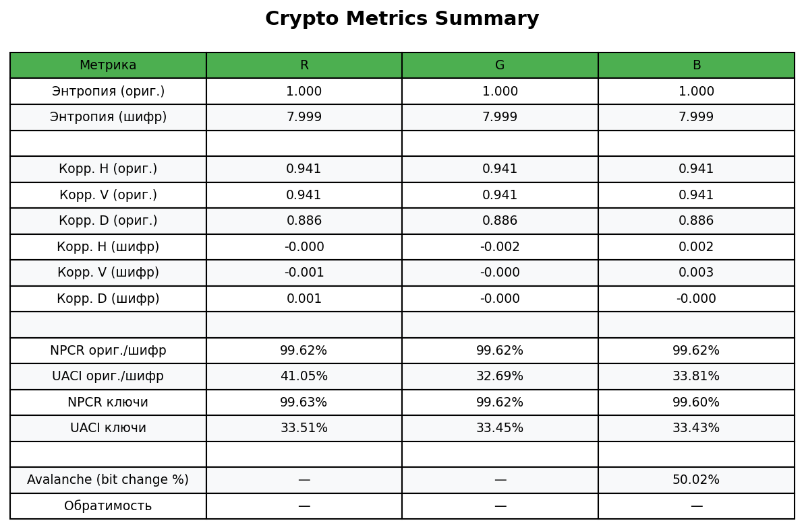
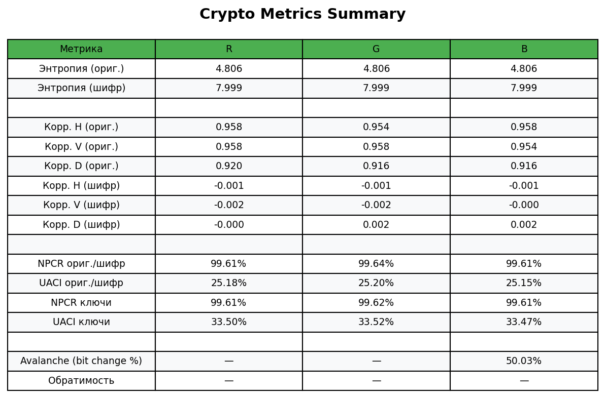

# Лабораторная 1: шифрование изображений

## Реализованные методы

### 1. Потоковый XOR
- Генерируем **keystream** при помощи генератора LCG. Каждое следующее число генерируется по формуле:
  ```math
  X_{n+1}=(a*X_n+c)mod(m)
  ```
  Самое первое число в последовательности генерируется на основе **seed**, который получается путём вычисления хеш-функции от конкатенации key и iv:
  ```
  def _seed_from_key_iv(key: bytes, iv: bytes) -> int:
    h = hashlib.sha256(key + iv).digest()
    return int.from_bytes(h[:8], "big")
  ```
  Таким образом, генерация последовательности псевдослучайных становится зависимой от key и iv.
- Переводим изображение в биты и далее выполняем операцию XOR для каждого бита изображения по формуле:
  ```
  A = B XOR C
  ```
  где A - итоговый бит зашифрованного изображения, B - бит исходного изображения, C - случайно сгенерированное число.

### 1. Перестановочный метод
- Делим изображение на блоки и перемешиваем по алгоритму Фишера-Йетса:
  ```
    indices = list(range(total_blocks))
    for i in range(total_blocks - 1, 0, -1):
        j = pr.next32() % (i + 1)
        indices[i], indices[j] = indices[j], indices[i]
  ```
  Создаётся массив индексов, а затем индексы перемешиваются. Для каждого индекса генерируется случайное число **j** при помощи уже упомянутого ранее алгоритма LCG, работающего на основании seed. Таким образом, перестановка блоков становится зависимой от key и iv.
- Полученную перестановку мы прогоняем через XOR-поток. Все генераторы и операции точно такие же, как в потоковом алгоритме.

## Как формируется и хранится IV/nonce
Для формирования IV был написан специальный метод, основанный на всё том же генераторе LCG, только с немного другими параметрами:
```
class SimpleIVGenerator:
    def __init__(self, seed: int = None):
        if seed is None:
            seed = (int(time.time_ns()) ^ os.getpid()) & 0xFFFFFFFF
        self.state = seed
        self.a = 1103515245
        self.c = 12345
        self.m = 2 ** 32

    def next_byte(self) -> int:
        self.state = (self.a * self.state + self.c) % self.m
        return self.state & 0xFF
```
В этот раз seed вычисляется на основании времени и pid текущего процесса, чтобы IV каждый раз генерировался уникальный. 
После шифрования каждого изображения IV записывается в соответствующий json файл вместе с остальными необходимыми для расшифровки параметрами.

## Метрики
Для проверки качества шифрования в ходе лабораторной работы вычислялись следующие метрики:
- **Энтропия**\
  Вычисляется по формуле:
  ```math
  H = -∑(p_i × log₂(p_i))
  ```
  где p_i - вероятность появления i-го байта.
  Отображает степерь хаотичности.
- **Корреляция соседних пикселей**\
  Вычисляется по формуле:
  ```math
  ρ = Σ[(xᵢ - μₓ) × (yᵢ - μᵧ)] / √[Σ(xᵢ - μₓ)² × Σ(yᵢ - μᵧ)²]
  ```
  где x_i, y_i - значения соседних пикселей, μ_x, μ_y - средние значения, N - количество пар пикселей.
  Корреляция показывает, насколько сильно всязаны значения соседних пикселей.
- **NPCR**\
  Вычисляется по формуле:
  ```
  NPCR = (Количество_измененных_байтов / Общее_количество_байтов) × 100%
  ```
  Показывает долю изменённых байт.
- **UACI**\
  Вычисляется по формуле:
  ```math
  UACI = (∑_{x=1}^{W} ∑_{y=1}^{H} |I₁(x,y) - I₂(x,y)| / (W × H × 255)) × 100%
  ```
  где I_1(x, y) и I_2(x, y) значения пикселей в первом и втором изображении соответственно.
  Показывает среднее значение абсолютной разницы интенсивностей.
- **Чувствительность к ключу (avalance)**\
  Вычисляется по формуле:
  ```
  Avalanche Effect = (Количество_измененных_битов / Общее_количество_битов) × 100%
  ```
  Показывает процент изменившихся бит.

### Результаты метрик для потокового XOR
#### Шахматная доска

#### Градиент

#### Шум

#### Собственное изображение


### Результаты метрик для перестановочного метода
#### Шахматная доска

#### Градиент

#### Шум

#### Собственное изображение


## Выводы по метрикам
- Энтропия во всех случая ≈ 8, что говорит о хорошей хаотичности в зашифрованных изображения.
- Корреляция у незашифрованных изображений стремится к 1, а у зашифрованных - к 0, из чего делаем вывод, что у зашифрованных изображений соседние пиксели различаются по цвету (изображение "шумное").
- NPCR близится к 100%, что говорит о том, что доля изменённых пикселей довольно большая (почти все пиксели).
- Avalanche ≈ 50%. Это значит, что при изменении ключа на 1 бит у нас меняется примерно 50% пикселей.\
В целом, оба метода шифрования показали примерно одинаковые результаты.

## Проверка обратимости
Для перестановочного метода была выполнена проверка обратимости. Сравнивался хеш исходного изображения и хеш расшифрованного изображения.\
Результаты проверки и сравнения хешей выводятся в консоль при дешифровке изображений перестановочным методом. Ниже представлены результаты для изображений, использованных в ходе лабораторной работы:
```
Decrypted (perm) -> imgs/decrypted/squirrel_perm.png

Проверка обратимости:
 - Хэш исходного файла : 7d2afff4e807e7aff01b13e7942842c821f0efd03a6b2b89db2e5bb43cb7d0e1
 - Хэш дешифрованного  : 7d2afff4e807e7aff01b13e7942842c821f0efd03a6b2b89db2e5bb43cb7d0e1
Обратимость подтверждена — файлы идентичны.
```
```
Decrypted (perm) -> imgs/decrypted/noise_texture_perm.png

Проверка обратимости:
 - Хэш исходного файла : 3b5a70259d193662c40d097b603dea60a50293ce2c051f0117332be7304d7b72
 - Хэш дешифрованного  : 3b5a70259d193662c40d097b603dea60a50293ce2c051f0117332be7304d7b72
Обратимость подтверждена — файлы идентичны.
```
```
Decrypted (perm) -> imgs/decrypted/gradient_perm.png

Проверка обратимости:
 - Хэш исходного файла : b868f563ef03ffc802432c499c76a69911a004279920889d62ccad9c94dbacd8
 - Хэш дешифрованного  : b868f563ef03ffc802432c499c76a69911a004279920889d62ccad9c94dbacd8
Обратимость подтверждена — файлы идентичны.
```
```
Decrypted (perm) -> imgs/decrypted/checkerboard_perm.png

Проверка обратимости:
 - Хэш исходного файла : 030160210071f9063ccc832bf90181ffe07bea0b2f107f75b89916ccaa9d1a61
 - Хэш дешифрованного  : 030160210071f9063ccc832bf90181ffe07bea0b2f107f75b89916ccaa9d1a61
Обратимость подтверждена — файлы идентичны.
Результаты проверки сохранены в results\checkerboard_perm_hashcheck.json
```


  
  
